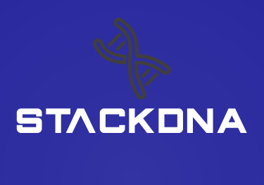
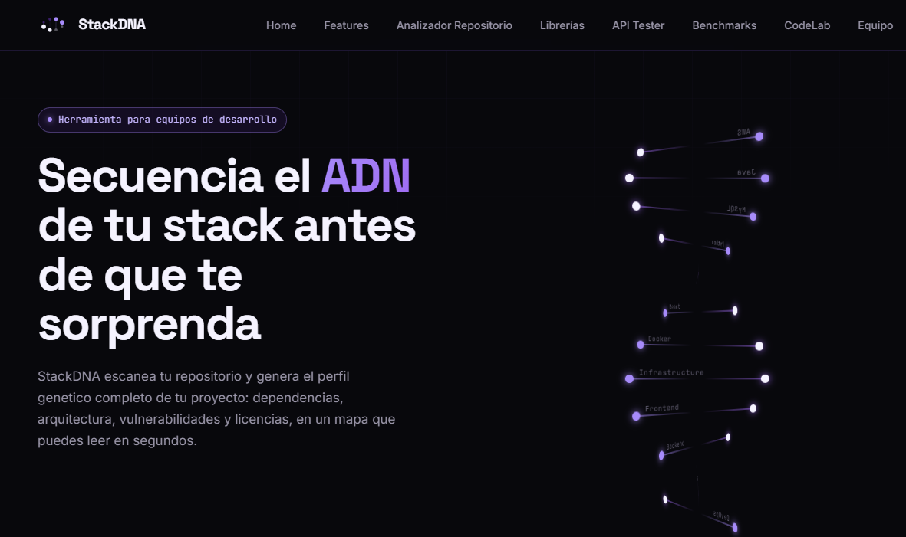
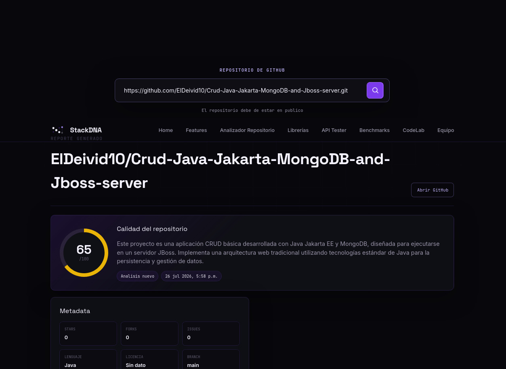
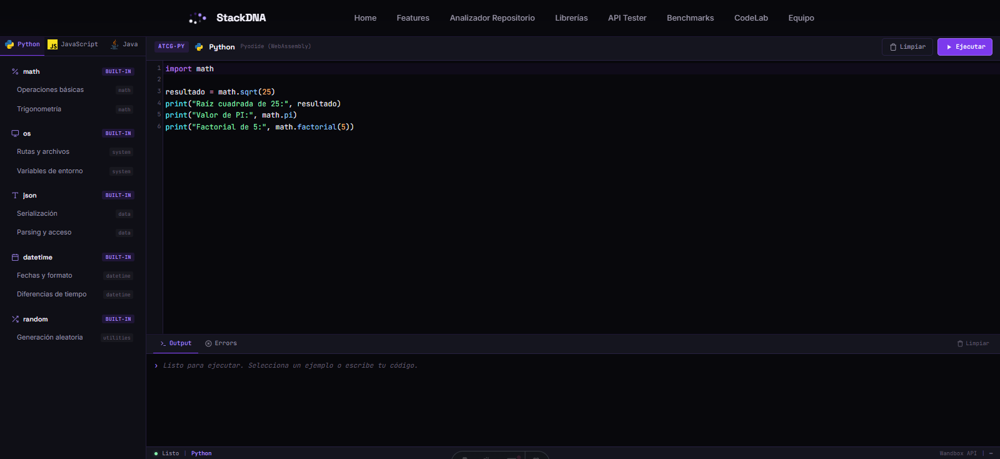
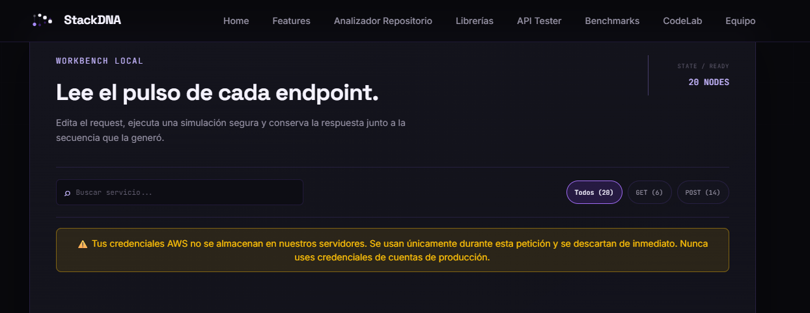
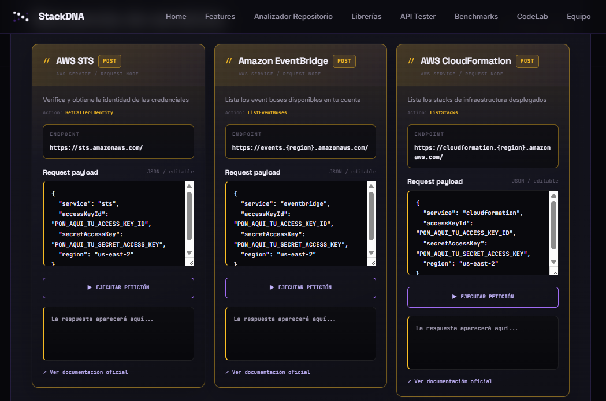
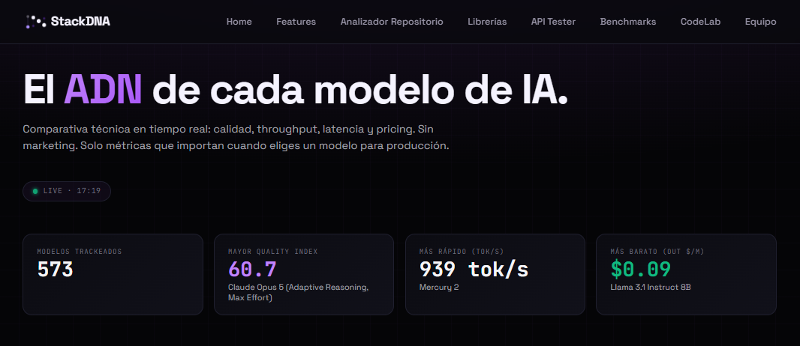
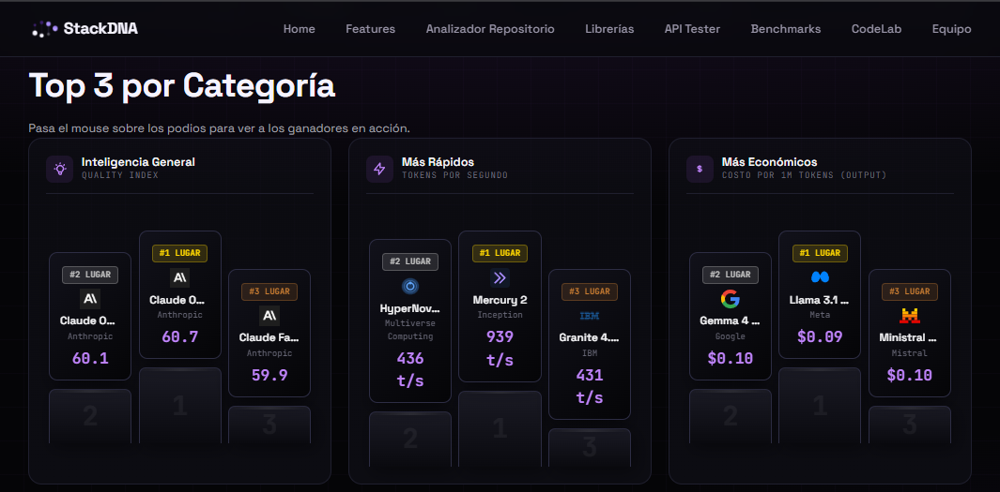
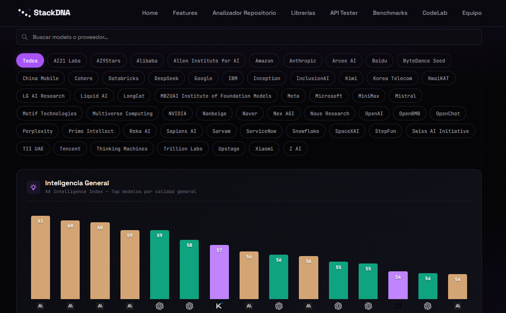

<p align="center">
  
</p>

<h1 align="center">StackDNA</h1>

<p align="center">
  <strong>Secuencia el ADN de tu stack antes de que te sorprenda.</strong>
</p>

<p align="center">
  <a href="https://github.com/robertytocerva/StackDNA"></a>
  <a href="https://github.com/robertytocerva/StackDNA/stargazers"></a>
  <a href="https://github.com/robertytocerva/StackDNA/issues"></a>
</p>

<p align="center">
  <a href="#-características-principales">Features</a> ·
  <a href="#-inicio-rápido">Inicio rápido</a> ·
  <a href="#-documentación-de-api">API Docs</a> ·
  <a href="#-estructura-del-proyecto">Estructura</a> ·
  <a href="#-cómo-contribuir">Contribuir</a>
</p>

<p align="center">
  
</p>

---

## Descripción

StackDNA es una plataforma web que escanea repositorios públicos de GitHub y genera el perfil genético completo de un proyecto: dependencias, arquitectura, vulnerabilidades y licencias, presentado en un mapa visual que se lee en segundos.

Más allá del análisis de repos, StackDNA integra un catálogo buscable de tecnologías (librerías, frameworks y APIs), un laboratorio de código en el navegador, un probador de servicios AWS y un benchmark comparativo de modelos de IA en tiempo real.

El proyecto nace de la necesidad de tener en un solo lugar las herramientas que un equipo de desarrollo consulta a diario: qué dependencias usa su stack, qué tan seguras son, cómo se comparan las alternativas y dónde probar código rápido sin salir del navegador.

---

## Características principales

- **Analizador de repositorios con IA** — Ingresa una URL de GitHub y obtén un reporte completo: stack detectado, lenguajes, dependencias, vulnerabilidades (OSV), estructura de archivos y un análisis generado por Google Gemini con fortalezas, mejoras y recomendaciones.
- **Catálogo de tecnologías** — Buscador con filtros por tipo (API, framework, librería, herramienta), categoría, lenguaje y texto libre. Datos sincronizados automáticamente desde npm, PyPI y Maven.
- **Code Lab** — Editor de código en el navegador con soporte para Python (Pyodide/WebAssembly), JavaScript (V8 nativo) y Java (ejecución remota). Incluye resaltado de sintaxis con CodeMirror y consola integrada.
- **AWS API Tester** — Probador integrado para 20 servicios de AWS (S3, Lambda, DynamoDB, EC2, IAM, Cognito, etc.) con credenciales temporales del usuario. Las keys nunca se almacenan.
- **AI Models Benchmark** — Comparativa técnica de modelos de IA en tiempo real: calidad, throughput, latencia y pricing. Datos desde la API de Artificial Analysis.
- **Detección de vulnerabilidades** — Cruza dependencias contra la base de datos OSV (Open Source Vulnerabilities) para identificar CVEs por severidad.

---

## Tabla de contenidos

- [Descripción](#descripción)
- [Características principales](#características-principales)
- [Requisitos previos](#requisitos-previos)
- [Inicio rápido](#-inicio-rápido)
- [Configuración](#-configuración)
- [Uso](#-uso)
- [Documentación de API](#-documentación-de-api)
- [Estructura del proyecto](#-estructura-del-proyecto)
- [Despliegue](#-despliegue)
- [Tecnologías utilizadas](#-tecnologías-utilizadas)
- [Equipo](#-equipo)
---

## Requisitos previos

| Requisito | Versión mínima |
|-----------|---------------|
| Node.js | >= 22.12.0 |
| PostgreSQL | >= 14 |
| npm | >= 9 |

Cuentas / API keys necesarias:

| Servicio | Propósito | Obtener |
|----------|-----------|---------|
| GitHub Personal Access Token | Análisis de repos (aumenta rate limits) | [GitHub Settings](https://github.com/settings/tokens) |
| Google Gemini API Key | Análisis con IA del repo analyzer | [Google AI Studio](https://aistudio.google.com/apikey) |
| Artificial Analysis API Key | Benchmark de modelos de IA (free tier) | [artificialanalysis.ai](https://artificialanalysis.ai/api-key-management-redirect) |

---

## Inicio rápido

El proyecto tiene tres servicios independientes. Clona el repositorio y levanta cada uno:

```bash
git clone https://github.com/robertytocerva/StackDNA.git
cd StackDNA
```

### 1. Backend principal (Catálogo + Repo Analyzer)

```bash
cd BackFinal
npm install
cp .env.example .env   # Configura las variables (ver sección Configuración)
npm run migrate        # Crea las tablas en PostgreSQL
npm run dev            # Inicia en http://localhost:3000
```

### 2. Backend de servicios (AWS Tester + Code Execution + Benchmarks)

```bash
cd backServices
npm install
cp .env.example .env   # Configura las variables
npm run dev            # Inicia en http://localhost:3001
```

### 3. Frontend (Astro)

```bash
cd front
npm install
npm run dev            # Inicia en http://localhost:4321
```

Abre [http://localhost:4321](http://localhost:4321) en tu navegador.

---

## Configuración

### BackFinal (`BackFinal/.env`)

| Variable | Descripción | Requerida |
|----------|-------------|-----------|
| `DATABASE_URL` | Connection string de PostgreSQL | Sí |
| `GITHUB_TOKEN` | Token de acceso personal de GitHub | Sí |
| `GEMINI_API_KEY` | API Key de Google Gemini | Sí |
| `PORT` | Puerto del servidor (default: 3000) | No |

### backServices (`backServices/.env`)

| Variable | Descripción | Requerida |
|----------|-------------|-----------|
| `PORT` | Puerto del servidor (default: 3001) | No |
| `FRONTEND_URL` | URL del frontend para CORS (default: http://localhost:4321) | No |
| `AA_API_KEY` | API Key de Artificial Analysis para benchmarks | Sí |

### Frontend (`front/.env`)

| Variable | Descripción | Requerida |
|----------|-------------|-----------|
| `PUBLIC_API_URL` | URL del backend principal | Sí |
| `PUBLIC_BACKEND_URL` | URL del backend de servicios | Sí |
| `PUBLIC_BACKEND_URL_BENCHMARKS` | URL para el endpoint de benchmarks | Sí |

---

## Uso

### Analizar un repositorio

1. Navega a la página **Revisión** (`/revision`).
2. Ingresa la URL de un repositorio público de GitHub (ej. `https://github.com/expressjs/express` o simplemente `expressjs/express`).
3. Obtén el reporte completo: metadata del repo, lenguajes, dependencias, vulnerabilidades detectadas, estructura y análisis con IA.

<p align="center">
  
</p>

### Buscar tecnologías

1. Ve a **Librerías** (`/librerias`).
2. Usa los filtros por lenguaje (JavaScript, Python, Java), tipo (API, framework, librería) o busca por nombre.
3. Explora las fichas con estadísticas, documentación y ejemplos.

### Ejecutar código

1. Abre el **Code Lab** (`/code-lab`).
2. Selecciona el lenguaje (Python, JavaScript, Java).
3. Escribe o carga un ejemplo y presiona ejecutar. El resultado aparece en la consola integrada.

<p align="center">
  
</p>

### Probar servicios AWS

1. Accede al **API Tester** (`/servicios`).
2. Ingresa tus credenciales temporales de AWS (Access Key ID, Secret Access Key, región).
3. Selecciona uno de los 20 servicios disponibles y ejecuta operaciones de solo lectura.

<p align="center">
  
</p>
<p align="center">
  
</p>


### Benchmark de modelos de IA

1. Visita **Benchmarks** (`/benchmarks`).
2. Explora la comparativa con podios 3D, estadísticas y tarjetas de cada modelo.
3. Filtra y ordena por calidad, velocidad, latencia o precio.

<p align="center">
  
</p>
<p align="center">
  
</p>
<p align="center">
  
</p>


---

## Documentación de API

### Backend principal (puerto 3000)

#### Catálogo de tecnologías

| Método | Ruta | Descripción |
|--------|------|-------------|
| `GET` | `/api/technologies` | Buscar y filtrar tecnologías |
| `GET` | `/api/technologies/:slug` | Detalle de una tecnología |
| `GET` | `/api/categories` | Listar categorías |
| `GET` | `/api/ecosystems` | Listar ecosistemas |

**Ejemplo:**

```bash
curl "http://localhost:3000/api/technologies?query=react&type=framework&lang=javascript"
```

#### Analizador de repositorios

| Método | Ruta | Descripción |
|--------|------|-------------|
| `POST` | `/api/repo-analyzer/analyze` | Analizar un repositorio |
| `GET` | `/api/repo-analyzer/history` | Últimos 10 análisis |

**Ejemplo:**

```bash
curl -X POST http://localhost:3000/api/repo-analyzer/analyze \
  -H "Content-Type: application/json" \
  -d '{"repoUrl": "https://github.com/facebook/react"}'
```

> Rate limit: 5 análisis por día por IP. Resultados cacheados 24 horas.

#### Administración

| Método | Ruta | Descripción |
|--------|------|-------------|
| `POST` | `/api/admin/sync/:source` | Sincronización manual (npm, pypi, maven) |
| `GET` | `/api/admin/sync/status` | Estado de sincronizaciones |

### Backend de servicios (puerto 3001)

| Método | Ruta | Descripción |
|--------|------|-------------|
| `POST` | `/api/aws/call` | Ejecutar llamada a servicio AWS |
| `POST` | `/execute` | Ejecutar código (legacy) |
| `POST` | `/code` | Ejecutar código via Wandbox |
| `GET` | `/api/benchmark/models` | Obtener benchmark de modelos de IA |
| `GET` | `/health` | Health check |

Para documentación detallada de cada endpoint con ejemplos de request/response, consulta:
- [`BackFinal/API_ENDPOINTS.md`](./BackFinal/API_ENDPOINTS.md)
- [`BackFinal/REPO_ANALYZER_ENDPOINTS.md`](./BackFinal/REPO_ANALYZER_ENDPOINTS.md)

---

## Estructura del proyecto

```
StackDNA/
├── front/                          # Frontend — Astro 7 + Tailwind CSS
│   ├── src/
│   │   ├── components/
│   │   │   ├── ApiTester/          # Probador de APIs AWS
│   │   │   ├── Benchmark/          # Comparativa de modelos IA
│   │   │   ├── CodeLab/            # Editor y consola de código
│   │   │   ├── Landing/            # Página principal (Hero, Features, FAQ)
│   │   │   ├── RepoAnalyzer/       # Resultados del análisis de repos
│   │   │   ├── FilterBar/          # Filtros del catálogo
│   │   │   └── SearchBar/          # Barra de búsqueda
│   │   ├── data/                   # Datos estáticos (servicios AWS, equipo)
│   │   ├── lib/                    # Utilidades y cliente API
│   │   ├── pages/                  # Rutas de Astro
│   │   ├── scripts/                # Lógica client-side (TypeScript)
│   │   └── styles/                 # CSS global y por módulo
│   └── package.json
│
├── BackFinal/                      # Backend principal — Express + PostgreSQL
│   ├── src/
│   │   ├── modules/
│   │   │   ├── catalog/            # CRUD y búsqueda de tecnologías
│   │   │   ├── repo-analyzer/      # Análisis de repositorios GitHub
│   │   │   └── admin/              # Sincronización y administración
│   │   ├── services/
│   │   │   ├── geminiService.js    # Integración con Google Gemini
│   │   │   ├── githubService.js    # Cliente de la API de GitHub
│   │   │   ├── osvService.js       # Consulta de vulnerabilidades (OSV)
│   │   │   ├── npmSync.js          # Sincronización con npm registry
│   │   │   ├── pypiSync.js         # Sincronización con PyPI
│   │   │   └── mavenSync.js        # Sincronización con Maven Central
│   │   ├── jobs/                   # Cron jobs de sincronización
│   │   └── config/                 # Configuración de base de datos
│   ├── migrations/                 # Migraciones Knex (PostgreSQL)
│   └── package.json
│
├── backServices/                   # Backend auxiliar — Express
│   ├── src/
│   │   ├── routes/
│   │   │   ├── aws.js              # POST /api/aws/call
│   │   │   ├── benchmark.js        # Proxy a Artificial Analysis API
│   │   │   ├── code.js             # Ejecución de código (Wandbox)
│   │   │   └── execute.js          # Ruta legacy de ejecución
│   │   ├── services/
│   │   │   ├── benchmarkService.js # Normalización de datos de benchmarks
│   │   │   ├── awsReadConfig.js    # Fábrica de config para AWS SDK
│   │   │   ├── s3Read.js           # S3: ListBuckets
│   │   │   ├── lambdaRead.js       # Lambda: ListFunctions
│   │   │   ├── dynamodbRead.js     # DynamoDB: ListTables
│   │   │   └── ...                 # 17 servicios AWS adicionales
│   │   └── middleware/             # Rate limit, seguridad, validación Zod
│   └── package.json
│
└── README.md
```

---

## Despliegue

El proyecto está desplegado en **Amazon Web Services (AWS)** utilizando la capa gratuita (Free Tier).

### Arquitectura de infraestructura

```
┌─────────────────────────────────────────────────────────────────┐
│                        AWS Cloud                                 │
│                                                                 │
│  ┌──────────────┐     HTTPS      ┌──────────────────────────┐  │
│  │ AWS Amplify  │ ─────────────► │  Amazon EC2 (Ubuntu)     │  │
│  │  (Frontend)  │                │                          │  │
│  │  Astro SSG   │                │  Nginx (Proxy inverso)   │  │
│  └──────────────┘                │  ┌────────────────────┐  │  │
│                                  │  │ PM2                │  │  │
│                                  │  │ ├─ API Principal   │  │  │
│                                  │  │ │  (puerto 3001)   │  │  │
│                                  │  │ └─ API Servicios   │  │  │
│                                  │  │    (puerto 3002)   │  │  │
│                                  │  └────────────────────┘  │  │
│                                  └────────────┬─────────────┘  │
│                                               │                 │
│                                               ▼                 │
│                                  ┌──────────────────────────┐  │
│                                  │  Amazon RDS              │  │
│                                  │  (PostgreSQL)            │  │
│                                  └──────────────────────────┘  │
│                                                                 │
│  Dominios:                                                      │
│    sdna-bp.duckdns.org → EC2 → API Principal                   │
│    sdna-bs.duckdns.org → EC2 → API Servicios                   │
│  SSL: Let's Encrypt (Certbot)                                   │
└─────────────────────────────────────────────────────────────────┘
```

| Servicio | Tecnología AWS | Descripción |
|----------|---------------|-------------|
| Frontend | AWS Amplify | Build estático de Astro, conectado al repo de GitHub |
| Backend principal | Amazon EC2 (t3.micro) | Express + puerto 3001 |
| Backend servicios | Amazon EC2 (t3.micro) | Express + puerto 3002 |
| Base de datos | Amazon RDS | PostgreSQL (Free Tier) |
| SSL/HTTPS | Let's Encrypt + Nginx | Certificados gratuitos con Certbot |
| Dominios | DuckDNS | Subdominios gratuitos apuntando a la IP de EC2 |

### Configuración del servidor EC2

**Security Group (puertos abiertos):**

| Puerto | Protocolo | Origen | Uso |
|--------|-----------|--------|-----|
| 22 | SSH | 0.0.0.0/0 | Administración remota |
| 80 | HTTP | 0.0.0.0/0 | Validación de Let's Encrypt |
| 443 | HTTPS | 0.0.0.0/0 | Tráfico seguro |

**Gestión de procesos con PM2:**

```bash
# Instalación
sudo npm install -g pm2

# Inicio de las APIs
pm2 start index.js --name "api1"
pm2 start index.js --name "api2"

# Configuración de auto-arranque (Startup)
pm2 startup
pm2 save
```

**Proxy inverso con Nginx** (`/etc/nginx/sites-available/default`):

```nginx
server {
    listen 80;
    server_name sdna-bp.duckdns.org;

    location / {
        proxy_pass http://127.0.0.1:3001;
        proxy_http_version 1.1;
        proxy_set_header Upgrade $http_upgrade;
        proxy_set_header Connection 'upgrade';
        proxy_set_header Host $host;
        proxy_cache_bypass $http_upgrade;
    }
}

server {
    listen 80;
    server_name sdna-bs.duckdns.org;

    location / {
        proxy_pass http://127.0.0.1:3002;
        proxy_http_version 1.1;
        proxy_set_header Upgrade $http_upgrade;
        proxy_set_header Connection 'upgrade';
        proxy_set_header Host $host;
        proxy_cache_bypass $http_upgrade;
    }
}
```

**Certificados SSL con Certbot:**

```bash
sudo certbot --nginx -d sdna-bp.duckdns.org
sudo certbot --nginx -d sdna-bs.duckdns.org
```

### Frontend en AWS Amplify

1. Se conectó directamente desde el repositorio de GitHub.
2. Se habilitó la opción **Monorepo** especificando la ruta del directorio `front/`.
3. Se configuraron las variables de entorno en la consola de Amplify:
   - `PUBLIC_API_URL` = `https://sdna-bp.duckdns.org`
   - `PUBLIC_BACKEND_URL` = `https://sdna-bs.duckdns.org`
4. Cada cambio en variables de entorno requiere un **redespliegue** (`git push` o rebuild manual desde la consola de AWS).

### Desplegar localmente

**Frontend:**

```bash
cd front
npm run build    # Genera la carpeta dist/
npm run preview  # Verifica el build localmente
```

**Backends:**

Ambos backends usan `npm start` para producción (sin `nodemon`). Asegúrate de configurar las variables de entorno antes de iniciar.

---

## Tecnologías utilizadas

### Frontend

| Tecnología | Propósito |
|------------|-----------|
| [Astro 7](https://astro.build/) | Framework web (SSG/SSR) |
| [Tailwind CSS 4](https://tailwindcss.com/) | Utilidades CSS |
| [GSAP](https://gsap.com/) | Animaciones scroll-driven |
| [TypeScript](https://www.typescriptlang.org/) | Tipado estático |
| [CodeMirror 5](https://codemirror.net/5/) | Editor de código en el navegador |
| [Pyodide](https://pyodide.org/) | Python en WebAssembly |
| [highlight.js](https://highlightjs.org/) | Resaltado de sintaxis |

### Backend principal

| Tecnología | Propósito |
|------------|-----------|
| [Express 5](https://expressjs.com/) | Framework HTTP |
| [PostgreSQL](https://www.postgresql.org/) | Base de datos relacional |
| [Knex.js](https://knexjs.org/) | Query builder y migraciones |
| [Google Gemini](https://ai.google.dev/) | Análisis con IA |
| [node-cron](https://github.com/node-cron/node-cron) | Jobs de sincronización programados |
| [express-validator](https://express-validator.github.io/) | Validación de inputs |

### Backend de servicios

| Tecnología | Propósito |
|------------|-----------|
| [Express 5](https://expressjs.com/) | Framework HTTP |
| [AWS SDK v3](https://docs.aws.amazon.com/AWSJavaScriptSDK/v3/latest/) | Integración con 20 servicios AWS |
| [Zod](https://zod.dev/) | Validación de esquemas |
| [Helmet](https://helmetjs.github.io/) | Headers de seguridad HTTP |

---

## Equipo

| GitHub | Rol |
|--------|-----|
| [@ElDeivid10](https://github.com/ElDeivid10) | Desarrollador Frontend (Astro.js) |
| [@robertytocerva](https://github.com/robertytocerva) | Desarrollador Backend (Node.js) |
| [@gustavocalderon067](https://github.com/gustavocalderon067) | Desarrollador Frontend (Astro.js) |
| [@ErickRodriguezR](https://github.com/ErickRodriguezR) | Desarrollador Backend (Node.js) |
| [@pazangel](https://github.com/pazangel) | Desarrollador Backend (Node.js) |

---

## Cómo contribuir

1. Haz fork del repositorio.
2. Crea una rama para tu feature o fix:
   ```bash
   git checkout -b feature/mi-nueva-feature
   ```
3. Realiza tus cambios y haz commit con mensajes descriptivos.
4. Asegúrate de que el proyecto levanta correctamente (frontend + backends).
5. Abre un Pull Request describiendo los cambios realizados.

### Convenciones

- Commits en español o inglés, preferiblemente con prefijos: `feat:`, `fix:`, `docs:`, `refactor:`.
- Variables y funciones en inglés (camelCase).
- Componentes Astro en PascalCase.

---

---

## FAQ

**¿Qué lenguajes y frameworks soporta el analizador?**

Node.js (npm), Python (PyPI) y Java (Maven) de forma nativa. Detecta `package.json`, `requirements.txt`, `pom.xml`, `go.mod`, `Gemfile`, `composer.json` y otros manifiestos.

**¿Qué tan rápido es el escaneo?**

El análisis de un repositorio promedio toma menos de 30 segundos.

**¿Es seguro ingresar mis credenciales de AWS?**

Las credenciales se envían al backend en cada request y se usan exclusivamente para esa llamada. Nunca se almacenan, nunca se loguean. El backend aplica Helmet, CORS restringido y rate limiting. Solo se ejecutan operaciones de lectura (`List*`, `Describe*`, `Get*`).

**¿El Code Lab ejecuta código en el servidor?**

Python se ejecuta en tu navegador vía WebAssembly (Pyodide). JavaScript corre directamente en el motor V8 del navegador. Java se ejecuta de forma remota a través de Wandbox/Piston API.

**¿Cómo se compara con Snyk o Dependabot?**

Esas herramientas se enfocan en vulnerabilidades puntuales. StackDNA construye el mapa completo de arquitectura y dependencias, y usa ese mapa como base para la auditoría, no al revés.
