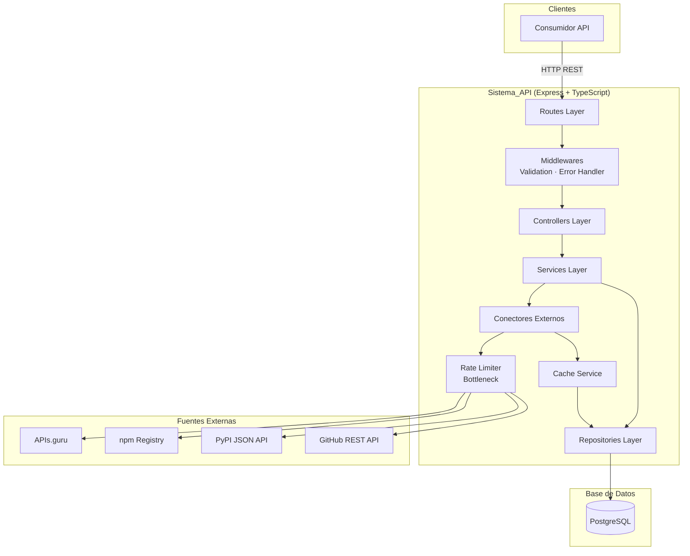
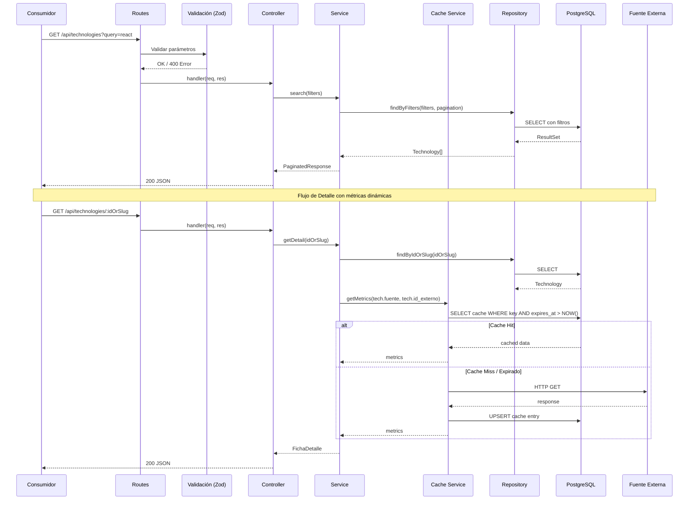
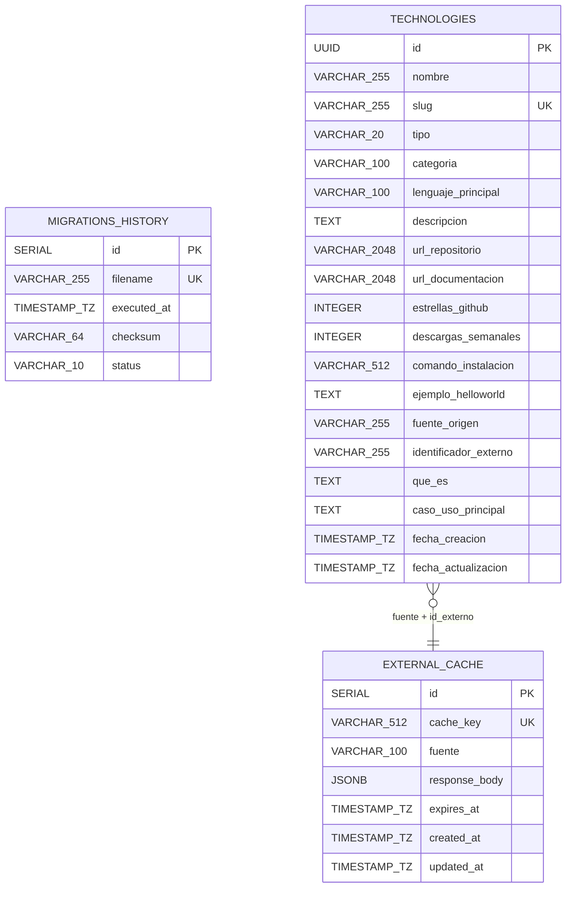

# Documento de Diseño — Technology Catalog API

## Resumen

Technology Catalog API es un backend REST construido con Node.js, Express y TypeScript que agrega información de tecnologías (APIs, frameworks y bibliotecas) desde múltiples fuentes públicas externas (APIs.guru, npm Registry, PyPI, GitHub). Los datos se normalizan y almacenan en PostgreSQL, y se exponen mediante endpoints REST públicos para búsqueda avanzada con filtros, paginación y fichas de detalle con sección "Aprende en 10 Minutos".

El sistema implementa un esquema de caché local en PostgreSQL para minimizar peticiones repetidas a fuentes externas y respetar rate limits. Un script de seeding inicial puebla la base de datos con un mínimo de 50 tecnologías desde el primer despliegue.

### Decisiones Técnicas Clave

| Decisión | Elección | Justificación |
|----------|----------|---------------|
| Runtime | Node.js 20 LTS + TypeScript 5.4 | Soporte LTS activo, ES2020+ nativo |
| Framework HTTP | Express 4.21 | Estándar de facto, ecosistema maduro |
| Cliente PostgreSQL | pg 8.13 | Driver nativo oficial, soporte pool |
| Migraciones | Sistema propio SQL versionado | Control total sobre historial con checksum SHA-256 según requisitos |
| Validación | Zod 3.23 | TypeScript-first, inferencia de tipos estática |
| HTTP Client externo | Axios 1.7 | Interceptores para retry, timeout configurable |
| Retry con backoff | axios-retry 4.5 | Backoff exponencial configurable, manejo de 429 |
| Rate Limiter | Bottleneck 2.19 | Zero-dependency, control por ventana de tiempo |
| Variables de entorno | dotenv 16.4 | Carga desde .env, estándar Node.js |
| UUID | crypto (nativo) | `crypto.randomUUID()` disponible en Node 20+ |

---

## Arquitectura

### Diagrama de Arquitectura del Sistema



### Flujo de Datos



---

## Componentes e Interfaces

### Estructura de Carpetas del Proyecto

```
back/
├── src/
│   ├── config/
│   │   ├── index.ts              # Exportación centralizada
│   │   ├── env.ts                # Validación y carga de variables de entorno
│   │   └── database.ts           # Configuración del pool PostgreSQL
│   ├── controllers/
│   │   ├── index.ts
│   │   ├── technology.controller.ts
│   │   └── health.controller.ts
│   ├── services/
│   │   ├── index.ts
│   │   ├── technology.service.ts
│   │   ├── cache.service.ts
│   │   ├── seeding.service.ts
│   │   └── connectors/
│   │       ├── index.ts
│   │       ├── connector.interface.ts
│   │       ├── apis-guru.connector.ts
│   │       ├── npm.connector.ts
│   │       ├── pypi.connector.ts
│   │       └── github.connector.ts
│   ├── repositories/
│   │   ├── index.ts
│   │   ├── technology.repository.ts
│   │   ├── cache.repository.ts
│   │   └── migration.repository.ts
│   ├── routes/
│   │   ├── index.ts
│   │   ├── technology.routes.ts
│   │   └── health.routes.ts
│   ├── middlewares/
│   │   ├── validation.middleware.ts
│   │   ├── error-handler.middleware.ts
│   │   └── not-found.middleware.ts
│   ├── utils/
│   │   ├── slug.ts               # Generación de slugs
│   │   ├── pagination.ts         # Helpers de paginación
│   │   └── logger.ts             # Wrapper de logging
│   ├── types/
│   │   ├── technology.types.ts
│   │   ├── api-response.types.ts
│   │   └── connector.types.ts
│   ├── migrations/
│   │   ├── runner.ts             # Motor de migraciones
│   │   └── scripts/
│   │       ├── 001_create_migrations_table.sql
│   │       ├── 002_create_technologies_table.sql
│   │       └── 003_create_cache_table.sql
│   └── app.ts                    # Bootstrap de Express
├── scripts/
│   └── seed.ts                   # Script de seeding ejecutable
├── tests/
│   ├── unit/
│   ├── integration/
│   └── property/
├── .env.example
├── package.json
├── tsconfig.json
└── README.md
```

### Interfaces Principales

#### Interfaz de Conector Externo

```typescript
interface ExternalConnector {
  readonly source: string;

  fetchList(params: { offset: number; limit: number }): Promise<ExternalTechnology[]>;
  fetchDetail(identifier: string): Promise<ExternalTechnology | null>;
}

interface ExternalTechnology {
  nombre: string;
  descripcion?: string;
  tipo: 'API' | 'Framework' | 'Library';
  categoria?: string;
  lenguaje_principal?: string;
  url_repositorio?: string;
  url_documentacion?: string;
  estrellas_github?: number;
  descargas_semanales?: number;
  comando_instalacion?: string;
  ejemplo_helloworld?: string;
  identificador_externo: string;
  fuente_origen: string;
}
```

#### Contratos de Endpoints HTTP REST

**GET /api/technologies — Búsqueda avanzada**

Request (query params):
```json
{
  "query": "string (opcional, max 200 chars)",
  "type": "API | Framework | Library (opcional)",
  "category": "string (opcional)",
  "language": "string (opcional)",
  "sort": "popularity | downloads | recent (opcional, default: recent)",
  "page": "integer (opcional, default: 1, min: 1)",
  "limit": "integer (opcional, default: 20, min: 1, max: 100)"
}
```

Response 200:
```json
{
  "total": 142,
  "page": 1,
  "limit": 20,
  "totalPages": 8,
  "data": [
    {
      "id": "550e8400-e29b-41d4-a716-446655440000",
      "nombre": "React",
      "slug": "react",
      "tipo": "Library",
      "categoria": "Frontend",
      "lenguaje_principal": "JavaScript",
      "descripcion": "Biblioteca para construir interfaces de usuario",
      "estrellas_github": 220000,
      "descargas_semanales": 25000000,
      "fuente_origen": "npm",
      "fecha_creacion": "2024-01-15T10:30:00.000Z",
      "fecha_actualizacion": "2024-06-20T14:00:00.000Z"
    }
  ]
}
```

**GET /api/technologies/:idOrSlug — Ficha de Detalle**

Response 200:
```json
{
  "id": "550e8400-e29b-41d4-a716-446655440000",
  "nombre": "React",
  "slug": "react",
  "tipo": "Library",
  "categoria": "Frontend",
  "lenguaje_principal": "JavaScript",
  "descripcion": "Biblioteca para construir interfaces de usuario",
  "url_repositorio": "https://github.com/facebook/react",
  "url_documentacion": "https://react.dev",
  "estrellas_github": 220000,
  "descargas_semanales": 25000000,
  "fuente_origen": "npm",
  "fecha_creacion": "2024-01-15T10:30:00.000Z",
  "fecha_actualizacion": "2024-06-20T14:00:00.000Z",
  "aprende_en_10_minutos": {
    "que_es": "Biblioteca JavaScript para construir interfaces de usuario declarativas basadas en componentes",
    "caso_uso_principal": "Desarrollo de aplicaciones web interactivas con estado reactivo y renderizado eficiente",
    "comando_instalacion": "npm install react react-dom",
    "ejemplo_helloworld": "import React from 'react';\nimport ReactDOM from 'react-dom/client';\n\nfunction App() {\n  return <h1>Hello World</h1>;\n}\n\nReactDOM.createRoot(document.getElementById('root')).render(<App />);"
  }
}
```

**GET /health — Health Check**

Response 200:
```json
{
  "status": "healthy",
  "timestamp": "2024-06-20T14:00:00.000Z",
  "version": "1.0.0",
  "checks": {
    "database": "connected"
  }
}
```

**Respuesta de Error (cualquier endpoint)**

```json
{
  "error": {
    "code": "VALIDATION_ERROR",
    "message": "Parámetros de entrada inválidos",
    "details": [
      { "field": "type", "reason": "Debe ser uno de: API, Framework, Library" },
      { "field": "page", "reason": "Debe ser un entero positivo" }
    ]
  }
}
```

### APIs Externas a Consumir

| Fuente | Base URL | Endpoints Usados | Rate Limit |
|--------|----------|------------------|------------|
| APIs.guru | `https://api.apis.guru/v2/` | `GET /list.json` (listado completo de APIs) | Sin límite documentado, configurar 30 req/min por precaución |
| npm Registry | `https://registry.npmjs.com/` | `GET /-/v1/search?text=&size=&from=` (búsqueda), `GET /{package}` (detalle) | Sin auth: ~limitado, configurar 30 req/min |
| PyPI | `https://pypi.org/` | `GET /pypi/{package}/json` (detalle de paquete), `GET /simple/` (índice) | Sin límite documentado, configurar 30 req/min |
| GitHub | `https://api.github.com/` | `GET /search/repositories?q=` (búsqueda), `GET /repos/{owner}/{repo}` (detalle) | Sin auth: 60 req/hora core, 10 req/min search. Con token: 5000 req/hora core, 30 req/min search |

**Nota sobre GitHub**: Se recomienda configurar un token personal (variable `GITHUB_TOKEN`) para aumentar los rate limits. El sistema funciona sin token pero con capacidad muy reducida (60 req/hora).

---

## Modelos de Datos

### Esquema Relacional PostgreSQL



### DDL Detallado

#### Tabla `migrations_history`

```sql
CREATE TABLE IF NOT EXISTS migrations_history (
    id SERIAL PRIMARY KEY,
    filename VARCHAR(255) NOT NULL UNIQUE,
    executed_at TIMESTAMP WITH TIME ZONE NOT NULL DEFAULT NOW(),
    checksum VARCHAR(64) NOT NULL,
    status VARCHAR(10) NOT NULL CHECK (status IN ('success', 'failed')),
    error_detail TEXT
);
```

#### Tabla `technologies`

```sql
CREATE TABLE technologies (
    id UUID PRIMARY KEY DEFAULT gen_random_uuid(),
    nombre VARCHAR(255) NOT NULL,
    slug VARCHAR(255) NOT NULL UNIQUE,
    tipo VARCHAR(20) NOT NULL CHECK (tipo IN ('API', 'Framework', 'Library')),
    categoria VARCHAR(100),
    lenguaje_principal VARCHAR(100),
    descripcion TEXT CHECK (char_length(descripcion) <= 5000),
    url_repositorio VARCHAR(2048),
    url_documentacion VARCHAR(2048),
    estrellas_github INTEGER DEFAULT 0 CHECK (estrellas_github >= 0),
    descargas_semanales INTEGER DEFAULT 0 CHECK (descargas_semanales >= 0),
    comando_instalacion VARCHAR(512),
    ejemplo_helloworld TEXT CHECK (char_length(ejemplo_helloworld) <= 10000),
    fuente_origen VARCHAR(255) NOT NULL,
    identificador_externo VARCHAR(255) NOT NULL,
    que_es VARCHAR(280),
    caso_uso_principal VARCHAR(280),
    fecha_creacion TIMESTAMP WITH TIME ZONE NOT NULL DEFAULT NOW(),
    fecha_actualizacion TIMESTAMP WITH TIME ZONE NOT NULL DEFAULT NOW(),
    CONSTRAINT uq_fuente_identificador UNIQUE (fuente_origen, identificador_externo)
);

-- Índices para búsqueda
CREATE INDEX idx_technologies_nombre_trgm ON technologies USING gin (lower(nombre) gin_trgm_ops);
CREATE INDEX idx_technologies_tipo ON technologies (tipo);
CREATE INDEX idx_technologies_categoria ON technologies (lower(categoria));
CREATE INDEX idx_technologies_lenguaje ON technologies (lower(lenguaje_principal));
CREATE INDEX idx_technologies_estrellas ON technologies (estrellas_github DESC);
CREATE INDEX idx_technologies_descargas ON technologies (descargas_semanales DESC);
CREATE INDEX idx_technologies_fecha_creacion ON technologies (fecha_creacion DESC);
```

#### Tabla `external_cache`

```sql
CREATE TABLE external_cache (
    id SERIAL PRIMARY KEY,
    cache_key VARCHAR(512) NOT NULL UNIQUE,
    fuente VARCHAR(100) NOT NULL,
    response_body JSONB NOT NULL CHECK (pg_column_size(response_body) <= 5242880),
    expires_at TIMESTAMP WITH TIME ZONE NOT NULL,
    created_at TIMESTAMP WITH TIME ZONE NOT NULL DEFAULT NOW(),
    updated_at TIMESTAMP WITH TIME ZONE NOT NULL DEFAULT NOW()
);

CREATE INDEX idx_cache_key ON external_cache (cache_key);
CREATE INDEX idx_cache_expires ON external_cache (expires_at);
CREATE INDEX idx_cache_fuente ON external_cache (fuente);
```

### Configuración de Tiempos de Expiración de Caché

| Fuente | TTL por defecto | Variable de entorno |
|--------|----------------|---------------------|
| APIs.guru | 24 horas | `CACHE_TTL_APIS_GURU` |
| npm Registry | 6 horas | `CACHE_TTL_NPM` |
| PyPI | 6 horas | `CACHE_TTL_PYPI` |
| GitHub | 12 horas | `CACHE_TTL_GITHUB` |

---

## Propiedades de Corrección

*Una propiedad es una característica o comportamiento que debe mantenerse verdadero en todas las ejecuciones válidas de un sistema — esencialmente, una declaración formal sobre lo que el sistema debe hacer. Las propiedades sirven como puente entre especificaciones legibles por humanos y garantías de corrección verificables por máquina.*

### Propiedad 1: Búsqueda por texto retorna solo coincidencias relevantes

*Para cualquier* cadena de búsqueda `q` no vacía y cualquier conjunto de tecnologías en el catálogo, todos los elementos en el resultado de búsqueda deben contener `q` (case-insensitive) en su campo `nombre` o en su campo `descripcion`.

**Valida: Requisitos 4.1**

### Propiedad 2: Filtros AND reducen resultados

*Para cualquier* combinación de filtros (type, category, language) aplicados a un conjunto de tecnologías, cada tecnología en el resultado debe satisfacer todos los filtros proporcionados simultáneamente, y el tamaño del resultado filtrado es menor o igual al tamaño sin filtros.

**Valida: Requisitos 4.2, 4.3, 4.4, 4.5**

### Propiedad 3: Paginación es consistente

*Para cualquier* resultado de búsqueda con total `T`, page `P` y limit `L`, se cumple que `totalPages == ceil(T / L)`, `data.length <= L`, y si `P <= totalPages` entonces `data.length == min(L, T - (P-1)*L)`.

**Valida: Requisitos 4.7, 4.8, 4.10**

### Propiedad 4: Slug es determinista y URL-safe

*Para cualquier* nombre de tecnología válido, la función de generación de slug produce una cadena compuesta exclusivamente por caracteres alfanuméricos en minúscula y guiones, con longitud máxima de 100 caracteres, y aplicar la función dos veces al mismo nombre siempre produce el mismo resultado.

**Valida: Requisitos 7.3**

### Propiedad 5: Validación rechaza entradas inválidas

*Para cualquier* valor de `type` que no sea "API", "Framework" o "Library", y para cualquier valor de `page` que no sea un entero positivo, y para cualquier `query` con más de 200 caracteres, el sistema retorna un error 400 con los campos inválidos listados en el detalle.

**Valida: Requisitos 9.1, 9.2, 9.3, 9.4, 9.5, 9.6**

### Propiedad 6: Caché hit evita petición externa

*Para cualquier* clave de consulta que tenga una entrada en caché cuyo `expires_at` sea posterior al momento actual, la invocación del conector debe retornar datos sin realizar ninguna petición HTTP a la fuente externa.

**Valida: Requisitos 6.2**

### Propiedad 7: Retry con backoff exponencial

*Para cualquier* petición a una fuente externa que falle con error de red o timeout, el conector debe reintentar exactamente 3 veces con intervalos crecientes (1s, 2s, 4s) antes de reportar el error final.

**Valida: Requisitos 3.8**

### Propiedad 8: Respuestas de error tienen estructura uniforme

*Para cualquier* respuesta de error del sistema (400, 404, 405, 500), el cuerpo JSON debe contener exactamente la estructura `{ error: { code: string, message: string } }` con `code` no vacío y `message` no vacío.

**Valida: Requisitos 8.1, 8.2, 8.3, 8.4**

### Propiedad 9: Limit se acota a 100

*Para cualquier* valor de `limit` proporcionado mayor a 100, el sistema debe acotar el tamaño de página a 100 sin retornar error, y el campo `limit` en la respuesta refleja el valor acotado.

**Valida: Requisitos 4.11**

### Propiedad 10: Ordenamiento es correcto

*Para cualquier* resultado de búsqueda con sort="popularity", cada elemento en la posición `i` debe tener `estrellas_github >= estrellas_github` del elemento en posición `i+1`. Análogamente para "downloads" con `descargas_semanales` y "recent" con `fecha_creacion`.

**Valida: Requisitos 4.6**

---

## Manejo de Errores

### Estrategia por Capa

| Capa | Comportamiento | Ejemplo |
|------|---------------|---------|
| **Routes/Middleware** | Validación con Zod; si falla → 400 con detalles | Parámetro `type=invalid` |
| **Controllers** | Captura excepciones del servicio, mapea a HTTP codes | `TechnologyNotFoundError` → 404 |
| **Services** | Lanza excepciones de dominio tipadas | `new NotFoundError('Technology not found')` |
| **Repositories** | Propaga errores de PG con contexto | Query timeout → `DatabaseError` |
| **Conectores** | Retry automático, fallback a caché expirado | Timeout en GitHub → usa caché |

### Clases de Error Personalizadas

```typescript
abstract class AppError extends Error {
  abstract readonly statusCode: number;
  abstract readonly code: string;
  details?: object;
}

class ValidationError extends AppError {
  statusCode = 400;
  code = 'VALIDATION_ERROR';
  constructor(public details: { field: string; reason: string }[]) {
    super('Parámetros de entrada inválidos');
  }
}

class NotFoundError extends AppError {
  statusCode = 404;
  code = 'NOT_FOUND';
}

class MethodNotAllowedError extends AppError {
  statusCode = 405;
  code = 'METHOD_NOT_ALLOWED';
}

class InternalError extends AppError {
  statusCode = 500;
  code = 'INTERNAL_ERROR';
}
```

### Middleware Global de Errores

El middleware global captura cualquier error no manejado:
- Si es instancia de `AppError`: responde con `statusCode` y estructura JSON estándar.
- Si es error desconocido: responde 500 con mensaje genérico, registra el stack trace completo en logs con un `correlationId` UUID que se incluye en `error.details`.
- Nunca expone nombres de clases, rutas internas ni SQL al cliente.

### Logging de Errores Internos

Cada error 500 registra:
- `correlationId` (UUID único)
- Método HTTP y ruta
- Query params
- Stack trace completo
- Timestamp UTC

---

## Estrategia de Testing

### Testing Unitario

- **Framework**: Vitest 2.1 (rápido, soporte nativo TypeScript)
- **Mocking**: vitest mocks nativos para dependencias externas (Axios, Pool de PG)
- **Foco**: Lógica de servicios, validaciones, generación de slugs, lógica de caché, mapeo de errores

Casos clave:
- Validación de parámetros de búsqueda (valores válidos e inválidos)
- Generación de slugs con casos edge (caracteres especiales, colisiones)
- Lógica de cache hit/miss/expired
- Normalización de datos de fuentes externas
- Health check con DB conectada/desconectada

### Testing de Integración

- **Foco**: Endpoints HTTP completos contra PostgreSQL de test
- **Setup**: Docker compose con PostgreSQL efímero, migraciones aplicadas antes de cada suite
- **Herramienta**: Supertest + Vitest

Casos clave:
- Flujo completo de búsqueda con filtros y paginación
- Ficha de detalle con métricas (cache hit y miss)
- Health check real contra DB
- Manejo de errores end-to-end

### Testing Basado en Propiedades (Property-Based Testing)

- **Librería**: fast-check 3.22 (compatible con Vitest, generadores ricos)
- **Configuración**: Mínimo 100 iteraciones por propiedad
- **Tag por test**: `// Feature: technology-catalog-api, Property N: [texto de propiedad]`

Propiedades implementadas como tests:
1. Búsqueda retorna solo coincidencias relevantes (Prop. 1)
2. Filtros AND reducen resultados (Prop. 2)
3. Paginación es consistente (Prop. 3)
4. Slug es determinista y URL-safe (Prop. 4)
5. Validación rechaza entradas inválidas (Prop. 5)
6. Caché hit evita petición externa (Prop. 6)
7. Retry con backoff exponencial (Prop. 7)
8. Respuestas de error tienen estructura uniforme (Prop. 8)
9. Limit se acota a 100 (Prop. 9)
10. Ordenamiento es correcto (Prop. 10)

### Estructura de Tests

```
tests/
├── unit/
│   ├── services/
│   │   ├── technology.service.test.ts
│   │   └── cache.service.test.ts
│   ├── utils/
│   │   ├── slug.test.ts
│   │   └── pagination.test.ts
│   └── middlewares/
│       └── validation.test.ts
├── integration/
│   ├── search.test.ts
│   ├── detail.test.ts
│   └── health.test.ts
└── property/
    ├── search.property.test.ts
    ├── slug.property.test.ts
    ├── validation.property.test.ts
    ├── cache.property.test.ts
    ├── pagination.property.test.ts
    └── sorting.property.test.ts
```

### Dependencias de Desarrollo

| Paquete | Versión | Propósito |
|---------|---------|-----------|
| vitest | 2.1.0 | Test runner |
| fast-check | 3.22.0 | Property-based testing |
| supertest | 7.0.0 | HTTP assertions en integración |
| @types/supertest | 6.0.0 | Tipos TypeScript |
| @types/pg | 8.11.0 | Tipos para pg |
